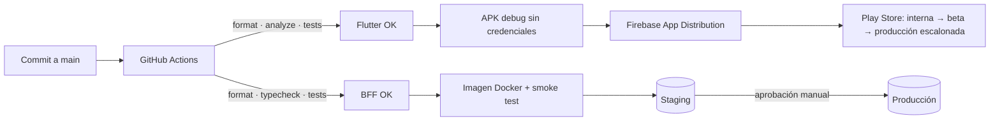

# Despliegue y operación

Cómo se despliega cada pieza, cómo se monitorea en producción y cómo se diagnostican problemas operativos y de experiencia de usuario.

## 1. Componentes y estrategia de despliegue

| Pieza | Artefacto | Destino propuesto | Cómo se libera |
|---|---|---|---|
| **App Flutter** | APK/AAB firmado (`flutter build appbundle --release --obfuscate --split-debug-info`) | Firebase App Distribution (QA) → Play Console (interna, beta, producción **escalonada 5 % → 25 % → 100 %**) | Tag `vX.Y.Z` en `main`. El rollout se detiene si sube la tasa de fallos (ver SLOs) |
| **BFF** | Imagen Docker (`backend/Dockerfile`, usuario sin privilegios, *healthcheck*) | Contenedor gestionado (Cloud Run, Render o Fly.io) con volumen o base de datos administrada | Despliegue continuo desde `main` a staging; promoción a producción con aprobación |
| **Mini apps** | Archivos estáticos (`mini_apps/`) | CDN u hosting estático de cada aliado (su propio origen) | Despliegue independiente: **no requiere publicar la app** |
| **Experiencia (SDUI) y flags** | Reglas en el BFF + `PUT /admin/flags` | Mismo BFF; en producción, un servicio de configuración remota | Cambios de contenido, orden y *kill switches* sin publicar la app |

**Trunk Based Development en el despliegue:**

- `main` siempre está desplegable.
- Lo incompleto llega a producción **apagado por un flag**.
- Un rollback de la app es detener el rollout escalonado; uno del BFF es volver a desplegar la imagen anterior.
- Una funcionalidad problemática se apaga con su *kill switch* en segundos.

**Configuración por entorno, sin secretos en el repositorio:**

- **App:** `--dart-define` para `ENV`, `API_BASE_URL`, `MINI_APPS_BASE_URL` y `ENABLE_DEBUG_TOOLS=false`; `google-services.json` por entorno.
- **BFF:** variables de entorno (`JWT_SECRET`, `ADMIN_KEY`, `FIREBASE_SERVICE_ACCOUNT_PATH`, `MINI_APP_ORIGINS`). Con `NODE_ENV=production` el BFF **exige** los secretos y **no registra** el chaos. El CI verifica que `/admin/chaos` responde 404 en la imagen.

## 2. Qué se observa

| Señal | Herramienta | Qué responde |
|---|---|---|
| Crashes y errores no controlados (Flutter y plataforma) | **Crashlytics** (`FlutterError.onError`, `PlatformDispatcher.onError`) | ¿Qué falla, en qué versión y dispositivo, a cuántos usuarios? |
| Breadcrumbs de red (método, ruta, estado, duración, intento, correlation-id) | Crashlytics (`TelemetryInterceptor`) | ¿Qué peticiones precedieron al error? |
| Errores de componentes SDUI | Crashlytics (`sdui_component_<tipo>`) + Analytics (`sdui_components_skipped`) | ¿El servidor envía componentes que una versión de la app no sabe dibujar? |
| Eventos de producto: `session_started`, `session_expired`, `biometric_unlock`, `push_permission`, `push_opened`, `mini_app_credit_requested`, `mini_app_message_rejected` | **Firebase Analytics** | Embudos de conversión, adopción y señales de fricción |
| Uso de la experiencia: `tapped`, `dismissed` | BFF (`user_events`) | ¿Qué contenido sirve y qué ignoran los clientes? |
| Logs estructurados con `reqId` = `x-correlation-id` | BFF (pino → stdout → agregador de logs) | Seguir una petición de la app al BFF |
| Salud | `GET /health` + *healthcheck* del contenedor | ¿Está vivo el proceso? |

**Privacidad:** la telemetría usa solo el id interno del cliente (`setUserId`), nunca su correo, nombre ni montos asociados a su identidad. Los interceptores no registran headers ni bodies.

## 3. SLOs propuestos

| SLO | Objetivo | Medición | Alerta (ventana) |
|---|---|---|---|
| Sesiones sin crash | **≥ 99,5 %** | Crashlytics *crash-free users* | < 99 % en 1 h → frena el rollout escalonado |
| Disponibilidad de la API | **≥ 99,9 %** de respuestas no-5xx | Logs del BFF | > 1 % de 5xx en 5 min |
| Latencia de login | **p95 < 2 s** | Duración en breadcrumbs y logs | p95 > 3 s durante 10 min |
| Latencia del home (experiencia) | **p95 < 800 ms** | Logs del BFF `/v1/experience/home` | p95 > 1,5 s durante 10 min |
| Sesiones expiradas inesperadamente | **< 1 %** de sesiones/día | Analytics `session_expired` / `session_started` | Pico × 3 sobre la media semanal (posible fallo del refresh) |
| Push entregados y abiertos | Apertura ≥ 10 % | Analytics `push_opened` + logs de envío | Caída > 50 % día contra día |
| Componentes SDUI omitidos | ≈ 0 en la versión actual | Analytics `sdui_components_skipped` | Cualquier valor > 0 en la última versión publicada |

## 4. Detección de problemas de experiencia (no solo técnicos)

Un servicio puede estar "arriba" y la experiencia igual ser mala. Señales a vigilar:

- **Circuito abierto o fallback de home:** la app muestra el layout embebido o datos en caché. Se ve como aumento de `ServiceUnavailableFailure` en breadcrumbs y como banners de "datos de hace X" visibles.
- **Reintentos:** el atributo `attempt > 0` en los breadcrumbs indica latencia o errores intermitentes antes de que se conviertan en fallos visibles.
- **Fricción:** caídas en el embudo `onboarding` → `session_started`, o `biometric_unlock{success:false}` repetidos.
- **Contenido irrelevante:** una tasa alta de `dismissed` en un insight o una promoción indica que la regla de personalización no aporta.

## 5. Runbook de diagnóstico

**Un cliente reporta "no me carga"** (el correlation-id viaja en cada petición y la pantalla de Diagnóstico lo muestra como código de soporte; mostrarlo en todos los mensajes de error es una mejora pendiente):

1. Busca el `reqId` en los logs del BFF. Ahí se ve la ruta, el estado y el tiempo, y si el chaos o el circuito intervinieron.
2. En Crashlytics, filtra por el id interno del usuario y revisa los breadcrumbs previos: intentos, timeouts, `circuitOpen`.
3. Clasifica el problema:
   - **4xx:** dato o regla de negocio. Revisa el `code` del error (`insufficient_funds`, `token_expired`…).
   - **5xx/502/503:** servicio degradado. Comprueba `GET /health` y los logs del servicio afectado.
   - **Sin red en el dispositivo** (`NoConnectionFailure`) frente a **red sí, servidor no** (`ServiceUnavailableFailure`): la app ya distingue ambos casos.

**Sube la tasa de crashes tras publicar:**

1. Detén el rollout escalonado en Play Console.
2. En Crashlytics, filtra por versión y agrupa por *issue*.
3. Si el fallo está en una funcionalidad con flag, **apágala** (`PUT /admin/flags`) mientras se corrige.

**Un servicio cae (por ejemplo, la experiencia o las cuentas):**

- **Comportamiento esperado:** home desde caché o embebido, saldos en caché con banner, circuito abierto que protege al servicio, recuperación automática al volver la red o el servicio. Detalle en [resilience.md](resilience.md).
- **Acción:** reiniciar o escalar el servicio. Ninguna acción hace falta en la app.

**Tokens de push inválidos en aumento:** el BFF los limpia automáticamente. Si crecen, revisa la configuración de Firebase del entorno (`google-services.json` y la clave de servicio).

## 6. Escalamiento

| Hoy (prueba) | Siguiente paso | Señal para hacerlo |
|---|---|---|
| SQLite en un contenedor | Postgres administrado (los repositorios aíslan el SQL) | Más de una instancia del BFF o más de ~50 escrituras/s |
| Motor de actividad con `setInterval` | Job programado + bus de eventos (Pub/Sub) | Varias réplicas (evitar actividad duplicada) |
| Push en el proceso del BFF | Cola dedicada con reintentos | Picos de movimientos o latencia del BFF por envíos |
| Flags en memoria | Servicio de configuración remota | Más de un BFF o flags por segmento/porcentaje |
| BFF único | BFF por canal y servicios de dominio detrás | Equipos con cadencias de despliegue distintas |
